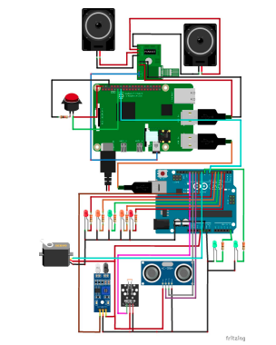
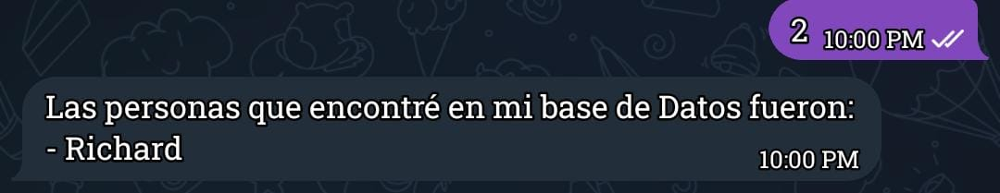
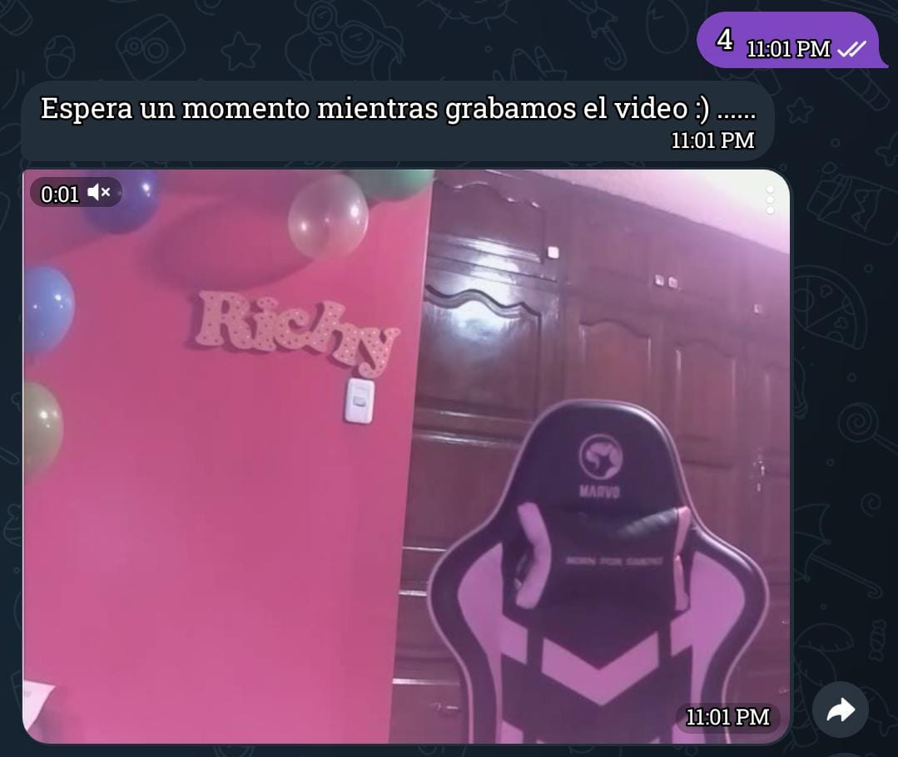
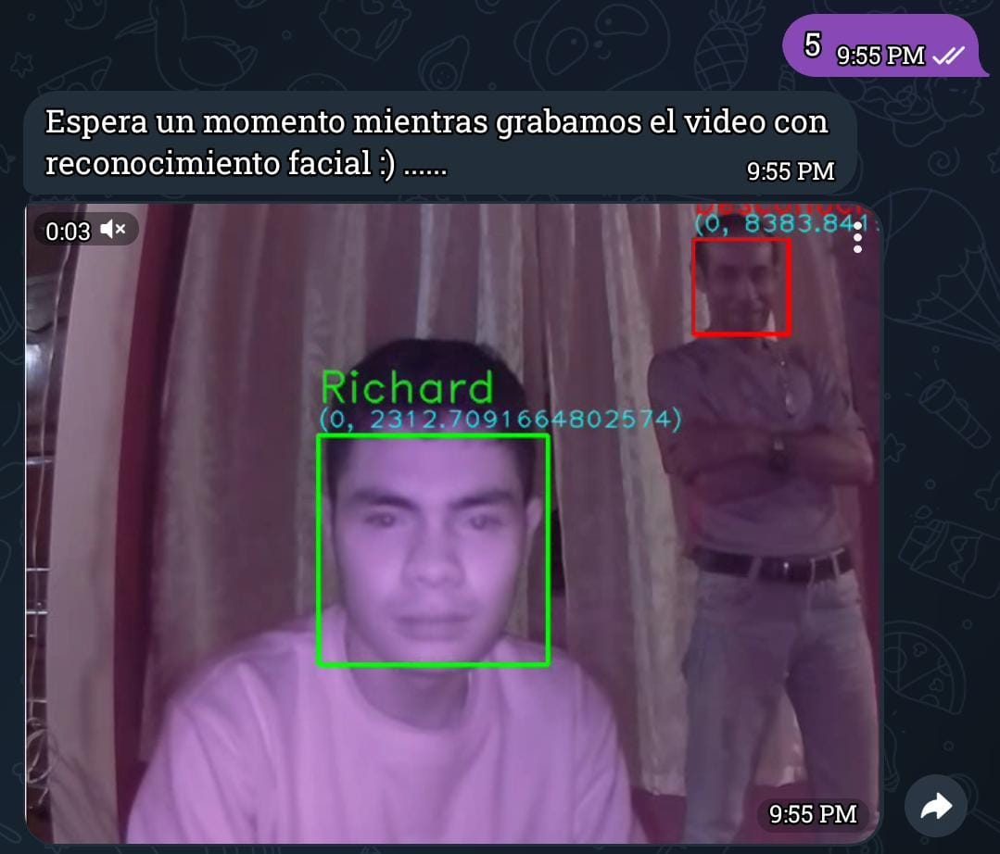
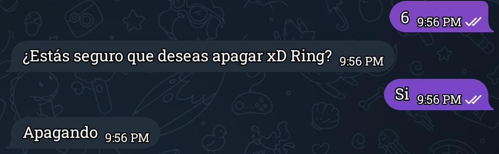
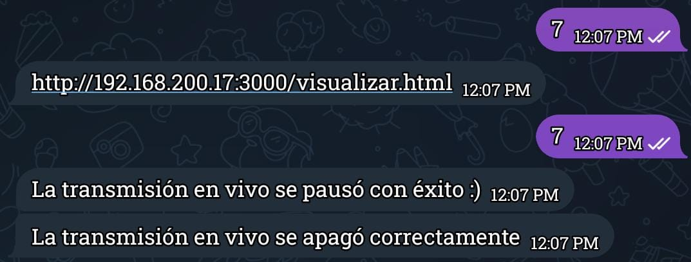
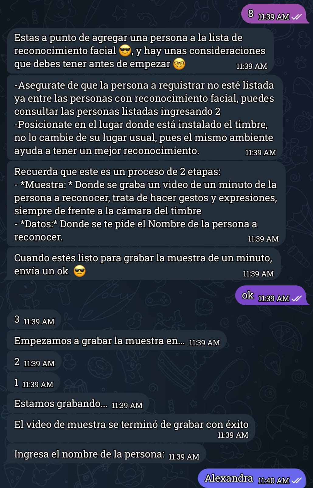
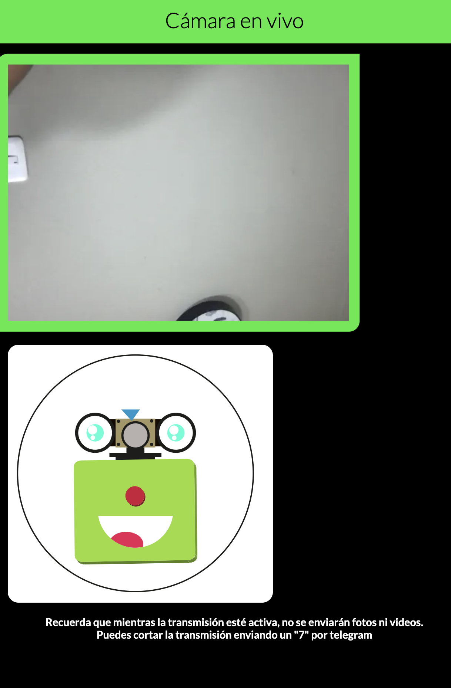

# XDRing
As a graduate project in high school, we built XDRing: automation and operation with Telegram, WebSockets, video streaming, face recognition, door control, and more (yes, even more).

## Initial Setup

**Requirements**

- Chromium Web Browser
- Omxplayer
- NodeJS
- Python3

**Installation**

1. Clone the repository

```bash
git clone https://github.com/Cotbert2/XDRing
cd XDRing
```

2. Install the dependencies

```bash
npm install
python3 -m venv venv
source venv/bin/activate
pip install -r requirements.txt
```

3. Create a `.env` file in the root directory and add the following variables:
```bash
TELEGRAM_TOKEN=YOUR_TELEGRAM_TOKEN
CHAT_ID=YOUR_CHAT_ID
```

4. Run the project

Make sure to run this as root

```bash
npm start
```


### What is XDRing?

XDRing is a project with the goal of automating and controlling a ring. The idea centers around the posibility of handle the security of a house, office, or any other place with a ring. The project is divided in two main parts: the hardware and the software.

#### Hardware:
The hardware center on computing with microcontrollers and sensors, as you can see in the following diagram:



1. **Raspberry Pi 4**: The main computer for the project, it handles the video streaming, the face recognition, and input bevavior.
2. **Arduino Uno**: Maybe You should asking why are we using two microcontrollers? The answer is simple, Asyncronous comunication wiht gpio sys is not good enough for our purposes, so we use the arduino to handle sensors and door control.

3. **Sensors***:
    * **Camera**: The camera is used for video streaming and face recognition.
    * **Ultrsonic HC-SR04**: The ultrasonic sensor is used to detect the distance of an object.
    * **Infrared sensor**: The infrared sensor is used to detect the presence of an object.
    * **LDR**: The LDR sensor is used to detect the light intensity.
    * **Servo motor**: The servo motor is used to move the camera through the horizontal axis. (180° to be exact)
    * **Relay**: The relay is used to control the door with a 110V AC power.


#### Software:

The software integration are separated in two main parts: Telegram bot (and their own operations) and computer Vision System.
As Programming languages we use Python and NodeJS.

1. **Telegram Bot**: The Telegram bot is used to control the ring remotely. We provide the user a complete menu to manage XDRing.

Below you can see the main operations of the bot:









Watch about the stream view page


2. **Protocols Involved**:

Protocol | Description
---|---
**WebSockets** | Used to enable the video streaming
**HTTP** | Used to set up server for the video streaming, also used to handle Telegram
**GPIO** | Used to control partial sensors and send signals to the arduino
**Serial** | Used to log inputs and outputs from the arduino

3. **Computer Vision System**: The computer vision system is used to detect faces and recognize them. We use OpenCV for this purpose.
To be recognized, the user must be registered in the system. The system is trained with the faces of the users, therefore you need to provide a video.

4. **Unix Services**: To interact between languages without handling network protocols as Sockets, we interac with python fron js using child_process executions, we create an instance of chromium to start the video streaming, also we kill this instance using pgrep.

### Suggestions

Maybe you wanna to start the program when the raspberry pi boots, you can do this by adding the following line to the `/etc/rc.local` file:
```bash
su pi -c 'cd /home/pi/XDRing
npm start'
```

### History


When we are 16 years old, we built XDRing as a graduation project (our high school sucks btw), now we are 19 and wanna to share this project with you.


### Wanna to contribute?

We are open to contributions, feel free to fork this project and make a pull request. We are open to suggestions and improvements.